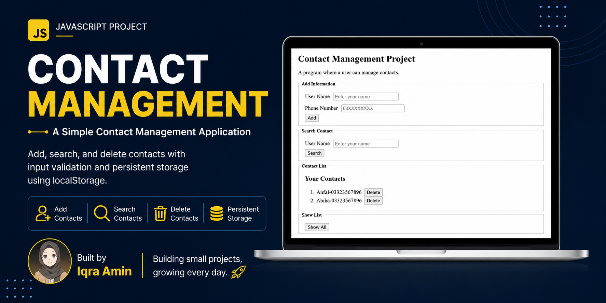

# 📇 Contact Management (JavaScript DOM Project)

  

  An interactive Contact Management application built using <strong>Vanilla JavaScript</strong> and <strong>DOM manipulation</strong>.

---

## 🚀 Features

- ➕ Add new contacts
- 📋 View all contacts
- 🗑️ Delete existing contacts
- 🔍 Search contacts by name (case-insensitive & partial match)
- 📂 Show all contacts after filtering
- ✅ Input validation
- 💾 Persistent storage using LocalStorage

---

## 🖥️ Tech Stack

- HTML5
- Vanilla JavaScript (ES6)
- DOM Manipulation
- Browser LocalStorage

---

## 💡 How It Works

- Add and manage contacts through an intuitive form.
- Contacts are stored as JavaScript objects in an array.
- The interface updates dynamically using DOM manipulation.
- Data is automatically saved in LocalStorage, allowing contacts to persist after page reloads.

---

## 🎯 Project Purpose

This project was built to strengthen my understanding of:

- JavaScript fundamentals
- DOM manipulation
- CRUD operations
- Application state management
- Problem-solving
- Building real-world interactive web applications

---

## 🧠 Skills Practiced

- JavaScript Fundamentals
- DOM Manipulation
- Event Handling
- Arrays & Objects
- CRUD Operations
- Input Validation
- Error Handling (try...catch)
- LocalStorage & JSON
- Problem Solving
- Git & GitHub Workflow

---

## 🔮 Future Improvements

- 🎨 Modern responsive UI
- ✏️ Edit and update contacts
- 🔄 Refactor using higher-order functions (`map`, `filter`, `find`)
- 📱 Better mobile experience
- 🌙 Dark mode

---

## 📷 Preview

  

---

## 👩‍💻 Author

**Iqra Amin**

Aspiring Frontend Developer

---

## Demo & Repository

🌐 **Repository:**  
https://github.com/iqraamin054-code/contact-manager-js